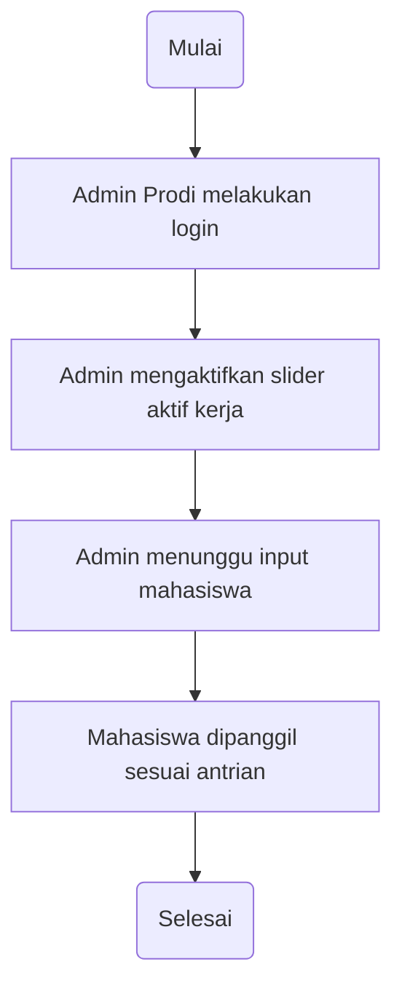
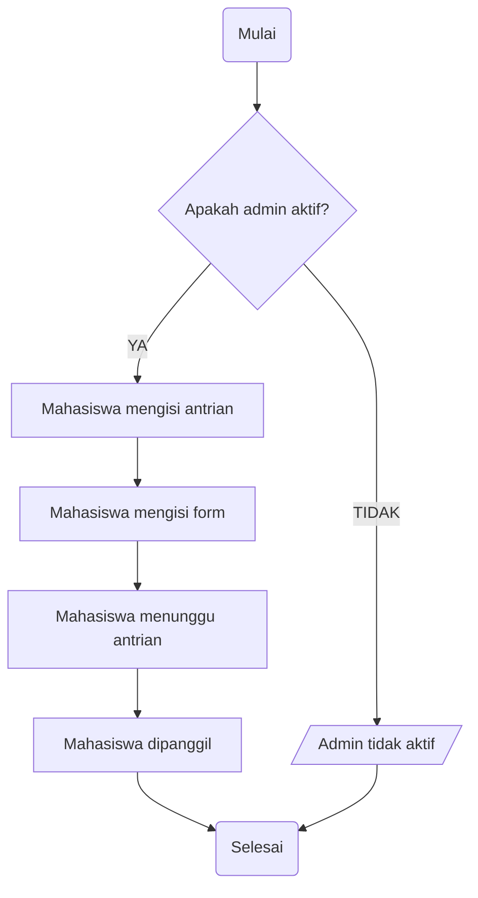

# Antrian JTI

Created with CodeSandbox.

## Collaborator

- Makhi Hakim
- Khoirul Usamah

## Deskripsi

Antrian JTI ini dibuat untuk memudahkan **antrian** dari sekian banyak mahasiswa **Jurusan Teknologi Informasi.**

## Alur Kerja

Alur kerja dari sistem Antrian JTI:

- Untuk bagian admin prodi

- Untuk bagian mahasiswa

